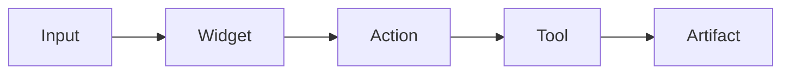

# Craft Widget Kit

Turn Craft Agents chat from prose into **generative command surfaces**: compact, predictable widgets that expose state, previews, actions, and handoffs.

## Principle

Do not treat Markdown as decoration. Treat it as a widget protocol.

Related skills:
- `craft-surface-router` — choose Markdown/datatable/spreadsheet/Mermaid/preview/plan surfaces.
- `last-widget-context` — interpret short follow-up chip commands against the last rendered widget.
- `craft-command-surfaces` — design slash commands as reusable widget surfaces.

```text
Widget = Header + Preview + State + Action Rail + Deep Link/Handoff
```

Prefer the simplest renderer that works:

1. Markdown card — default for compact previews
2. `datatable` — sortable lists, queues, inventories
3. `spreadsheet` — grid trackers, schedules, tabular workbooks
4. Mermaid — architecture/routing/process maps
5. `image-preview` — generated images, slide screenshots, visual galleries
6. `html-preview` — mini apps and complex dashboards from files
7. `SubmitPlan` — approval workflow for multi-step execution

## Default card grammar

```markdown
## <icon> <Widget Title>

|  |  |
|---|---|
| <preview> | **<primary>**<br><secondary><br>`<state chip>` · `<state chip>` |

`action` short label · `action` short label · [open ↗](<url-or-file>)
```

Rules:
- Keep default cards under ~8 visible lines.
- Use Markdown image links over raw HTML images for chat reliability.
- For file-backed rich blocks (`html-preview`, `image-preview`, `pdf-preview`, `datatable`, `spreadsheet`), emit an **absolute** `src` path. Relative `data/...` paths fail in this harness with “Only absolute file paths are allowed.”
- Escape `|` in table text as `\|`.
- Use `<br>` inside table cells for controlled compact layout.
- Do not over-explain the widget after rendering it unless asked.
- If a visual block fails or is too large, fall back to a plain Markdown card.

## Action semantics

Action chips are conversational affordances. When the next user message matches a chip, apply it to the last rendered widget.

Example:

```text
LastWidgetContext:
  id: yt-recent:<video_id>
  actions:
    brief: transcript → 5 bullets
    clip: transcript around resume timestamp
    claims: factual assertions / predictions / benchmarks
    signals: models/tools/companies/workflows
    queue: enqueue research artifact
```

If ambiguous, ask one short clarifying question. Otherwise execute.

## Core widgets

### MediaPreviewCard

Use for YouTube, podcasts, recordings, links with thumbnails.

```markdown
## ▶ Latest YouTube

|  |  |
|---|---|
| [](<resume_url>) | **<title>**<br><channel><br>`resume <h:mm:ss>` · `<percent if known>` |

`brief` 5 bullets · `clip` resume-point · `claims` assertions · `signals` tech map · `queue` research · [open ↗](<resume_url>)
```

### DecisionCard

Use when recommending one path among options.

```markdown
## ◆ Decision

| Pick | Why | Risk |
|---|---|---|
| **<recommended>** | <short reason> | <main caveat> |

`expand` rationale · `compare` options · `plan` implementation
```

### ResearchQueueTable

Use `datatable` for more than ~5 items.

````markdown
```datatable
{
  "title": "Research Queue",
  "columns": [
    { "key": "item", "label": "Item", "type": "text" },
    { "key": "lane", "label": "Lane", "type": "badge" },
    { "key": "action", "label": "Next", "type": "badge" }
  ],
  "rows": []
}
```
````

### PlanHandoffCard

Use before `SubmitPlan` or after writing a plan.

```markdown
## ◇ Plan Ready

| Scope | Checkpoint | Output |
|---|---|---|
| <scope> | <review gate> | <artifact path> |

`submit` for review · `revise` plan · `execute` after approval
```

### SystemMap

Use Mermaid for flows and architecture. Validate complex diagrams before outputting.

````markdown

````

## Rich block selection

| Need | Use |
|---|---|
| One latest item | Markdown card |
| 2–10 compact items | Markdown table |
| 10+ sortable rows | `datatable` |
| Spreadsheet-like tracker | `spreadsheet` |
| Architecture/process | Mermaid |
| Image or screenshot gallery | `image-preview` |
| Full interactive app | write HTML + `html-preview` |
| Approval gate | `SubmitPlan` |

## Pipeline

```
Input (data / preview / decision / queue / plan / map to render)
  ↓
Widget Type Selection (MediaPreview / Decision / Queue / Plan / SystemMap)
  ↓
Widget Assembly (header + preview + state chips + action rail)
  ↓
Surface Routing (delegate to craft-surface-router for Markdown vs rich block)
  ↓
Artifact Routing
  ├── Chat output (rendered widget)
  ├── data/<slug>.json (datatable/spreadsheet file-backed widgets)
  └── data/<slug>.html (html-preview file-backed widgets)
```

## Modes

### Default: Compact Card
- Render the appropriate widget type in under ~8 visible lines.
- Include action rail with 3–5 chip actions.

### expanded
- Larger preview with more detail. `mqdefault.jpg` instead of `default.jpg` for media. Full table rows.

### raw
- Unstyled data dump. No widget chrome. For when the operator wants the raw data.

### design
- Show the widget grammar/skeleton without real data. For designing slash-command output templates.

## Artifact Routing

| Widget type | File-backed? | Path |
|------------|-------------|------|
| MediaPreviewCard | No | Inline Markdown |
| DecisionCard | No | Inline Markdown |
| ResearchQueueTable | Yes (datatable) | `data/<slug>.json` via `transform_data` |
| PlanHandoffCard | No (or SubmitPlan) | Plan file path |
| SystemMap | No | Inline Mermaid |
| HTML dashboards | Yes | `data/<slug>.html` (absolute path) |

**Critical:** For file-backed widgets, always emit an **absolute** `src` path. Relative paths fail.

## Fallback Chain

1. **Primary: Rich widget** — Render the correct widget type with appropriate surface.
2. **Markdown card** — When rich blocks fail or are unavailable, degrade to a Markdown table/card.
3. **Plain text** — When Markdown tables break (e.g., unescaped pipes), fall back to plain text list.
4. **File path only** — When rendering completely fails, output the file path and let the operator open it manually.

## Prerequisites

- Craft Agents harness (for rich block rendering)
- `craft-surface-router` skill (for surface selection decisions)
- `last-widget-context` skill (for action chip follow-ups)
- `transform_data` tool (for 20+ row datasets)
- `mcp__session__mermaid_validate` (for SystemMap Mermaid diagrams)

## Error Handling

| Failure | Recovery |
|---------|----------|
| Rich block fails to render | Fall back to Markdown card equivalent |
| Markdown table breaks on special chars | Escape `\|` in all cell content; or switch to bullet list |
| Image thumbnail unavailable | Use text-only preview without thumbnail |
| Action chip ambiguous | Ask one short clarifying question via `last-widget-context` |
| Mermaid diagram too complex | Simplify to top-level nodes; offer `expand <node>` for detail |
| File write fails for HTML dashboard | Render inline Markdown version; note file write failure |

## Contract

- **Compact by default:** Keep default cards under ~8 visible lines. Operator can request `expanded` for more.
- **Action rails required:** Every widget must include actionable chips. Never render a dead-end widget.
- **Escape pipes:** Always escape `|` as `\|` in table content. Broken Markdown tables are worse than plain text.
- **Markdown image links over raw HTML:** Markdown `` renders more reliably than `` tags in Craft chat.
- **Absolute paths for file-backed blocks:** `src` must be absolute. No relative paths.
- **Widget = protocol, not decoration:** Markdown structure carries semantic meaning (header = widget type, table = preview, action rail = affordances). Treat it as a protocol.
- **No over-explanation:** After rendering a widget, do not explain what it shows unless asked. The widget should be self-evident.

## Craft-specific gotchas

- Raw HTML image sizing may not render consistently; Markdown image links are safer.
- Markdown tables break on unescaped `|` in titles.
- `image-preview`, `html-preview`, `pdf-preview`, `datatable`, and `spreadsheet` can read from files via Craft platform actions when blocks reference `src`.
- In this Craft Agents harness, `src` must be an absolute local file path. Do not emit relative paths like `data/report.html`; emit paths like `/Volumes/☯Duality/spaces/developer/data/report.html`.
- Keep widgets dense; Craft chat rewards compact surfaces more than long prose.
- For generated files, state the path once and offer `open` / `reveal` style actions.
