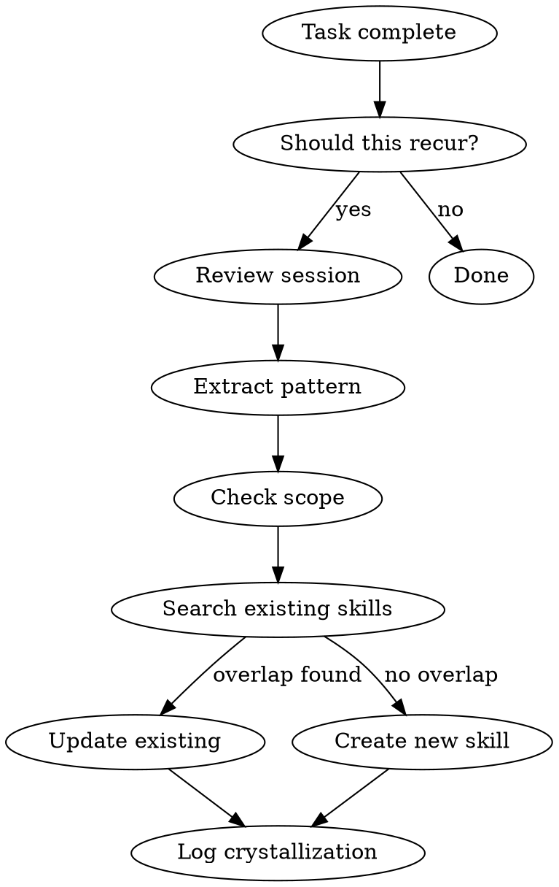

# Crystallize

Self-introspection to skill crystallization. After novel deep work, extract reusable patterns into formal skills so future sessions don't redo the same reasoning.

## When to Use

- After completing a multi-step task that involved significant reasoning or research
- When the solution involved discovery, heuristics, or decision points not obvious from the codebase
- When the operator asks to "capture this as a skill" or "make this reusable"
- Before ending a session where significant pattern discovery occurred

**Do NOT crystallize:**
- One-off file edits that won't repeat
- Pure search/discovery without reusable methodology
- Things already covered by existing skills (check first)
- Operations obvious from the codebase itself

## Workflow



### 1. Review

What was the task? What problem did I solve? What did I learn? What steps would I repeat next time?

### 2. Pattern Extraction

Identify the reusable pattern:
- **Key steps**: What's the minimal sequence that produces the result?
- **Heuristics**: What judgment calls were required? What rules of thumb emerged?
- **Gotchas**: What went wrong or nearly went wrong? What assumptions failed?
- **Decision points**: Where did I choose between approaches? What determined the choice?

### Exploratory-Mode Expansion

When the operator asks for "more crystallization" or references `--exploratory-mode`, do not stop at the first local fix. Expand one ring outward and capture the broader reusable rule.

Use this sweep:
1. Start from the exact thing that was fixed.
2. Check the nearest adjacent surfaces that could carry the same stale assumption:
   - sibling skills or docs
   - status dashboards or rollups
   - automation or reminders
   - source-of-truth references
3. Separate true active surfaces from history, archives, and examples.
4. Crystallize the fan-out rule into the narrowest existing skill that governs that domain.
5. If no domain skill exists, update this skill or create a new one only after deduplication.

Default heuristic: exploratory crystallization should broaden one layer, not explode into a full repo rewrite.

### Operator Drag-Signal Fast Path

If the operator says any variant of:

- `--crystallize`
- "this took too long"
- "why aren't you using ..."
- "you should have ..."

stop normal forward progress and crystallize immediately.

Use this sequence:

1. identify the missed governing skill or policy
2. update that existing surface first
3. only then resume the task

Do not defer crystallization to end-of-session once the operator has already flagged session drag or pattern failure.

### Operator Correction Override

If the operator directly corrects an account, profile, path, owner, or boundary:

1. treat that correction as the live source of truth immediately
2. update the governing existing skill or operator-policy surface before more task work
3. never let stale AGENTS notes, memory, browser history, or previous assumptions re-overrule the correction in the same session

Default retrofit targets:
- operator-wide behavior -> `operator-patterns`
- domain-specific routing -> existing domain skill (for example `shadow-recorder`)
- enterprise entrypoint -> matching Astemo wrapper skill (for example `astemo-recorder`)

### 3. Scope Check

- **Too narrow**: Only applies to this exact file/situation → don't crystallize
- **Too broad**: Already covered by an existing skill → update that skill instead
- **Just right**: Generalizable methodology with concrete trigger conditions → crystallize

### 4. Deduplication Check

Search existing skills for overlap before creating new ones. If a related skill exists, UPDATE it with the new pattern rather than creating a duplicate.

### 5. Create or Update Skill

**If no related skill exists**, create a new one following this template:

```markdown
# Skill Name

One-line description. Use when [trigger phrases].

## When to Use
- [trigger 1]
- [trigger 2]
- [trigger 3]

## Workflow
1. [Step 1]
2. [Step 2]
3. [Step 3]

## Key Decisions
- [Decision point 1]: [default choice + why]
- [Decision point 2]: [default choice + why]

## Gotchas
- [Common mistake 1]
- [Common mistake 2]

## Crystallized From
- Session: [date/context]
- Original task: [what was being solved]
```

**If a related skill exists**, add the new pattern as a new section or extend the existing workflow. Preserve the skill's existing structure.

### 6. Log the Crystallization

Record metadata at the bottom of the skill under `## Crystallized From`:
- Session date and context
- Original task being solved
- What pattern was extracted
- If exploratory-mode was used, note what adjacent surfaces were checked and which ones were intentionally left untouched.

## Placement

- General patterns → `~/.agents/skills/<skill-name>/SKILL.md`
- Enterprise-specific patterns → appropriate subdirectory under `~/.agents/skills/`

## Relationship to SP-006

SP-006 (latent skill observer) detects patterns from tool call sequences automatically. This skill complements SP-006 by adding **intentional** crystallization from reasoning — patterns that emerge from understanding the problem, not just from observing tool usage. Both mechanisms feed the same skill namespace.

## Integration Note

AGENTS.md files should include: "After novel multi-step work, invoke the `crystallize` skill to capture reusable patterns."

## Pipeline

```
Input (task complete, drag-signal, operator correction, or "crystallize" trigger)
  ↓
Review Session (what was solved, what was learned, what would repeat)
  ↓
Pattern Extraction (key steps, heuristics, gotchas, decision points)
  ↓
Scope Check (too narrow? too broad? just right?)
  ↓
Deduplication Check (search existing skills for overlap)
  ↓
Decision:
  ├── Overlap found → UPDATE existing skill
  └── No overlap → CREATE new skill
  ↓
Create/Update Skill (write SKILL.md with frontmatter + body)
  ↓
Log Crystallization (Crystallized From section in skill)
  ↓
Artifact Generation
  ├── ~/.agents/skills/<name>/SKILL.md  (new or updated skill)
  └── docs/plans/crystallization-log.md  (optional history)
```

## Modes

| Mode | Output | When |
|------|--------|------|
| `default` | Full crystallization: review → extract → scope → deduplicate → create/update | `crystallize`, `capture this as a skill` |
| `quick` | Fast capture to a minimal skill stub (full refinement later) | `quick crystallize`, mid-task pattern discovery |
| `exploratory` | Expand one ring outward from the fix; check adjacent surfaces for same pattern | `--exploratory-mode`, `more crystallization` |
| `drag-response` | Immediate crystallization triggered by operator frustration | `this took too long`, `why aren't you using...` |
| `correction` | Immediate update from operator correction | Operator corrects an identity/path/boundary |
| `audit` | Check what should have been crystallized but wasn't | `what patterns did we miss` |

## Artifact Routing

| Artifact | Path | Purpose |
|----------|------|----------|
| New skill | `~/.agents/skills/<slug>/SKILL.md` | Reusable capability |
| Updated skill | Same path as existing skill | Extended capability |
| Crystallization log | `docs/plans/crystallization-log.md` | History of all crystallizations (optional) |
| Enterprise-specific skill | Appropriate `~/.agents/skills/` subdirectory | Domain-scoped capability |

## Fallback Chain

1. **Primary:** Full workflow — review → extract → scope → deduplicate → create/update → log
2. **Skill directory not writable:** Write to current project's `.agents/skills/` as fallback; note that home-dir install is preferred
3. **Existing skill found but too large to update safely:** Create a companion `REFERENCE.md` for detail; keep `SKILL.md` focused
4. **Pattern too narrow for standalone skill:** Record as a gotcha or heuristic in the most relevant existing skill instead
5. **Last resort:** Inline note in chat with explicit statement: "This pattern should be crystallized into a skill but no writable path was available."

## Prerequisites

- Writable skill directory (`~/.agents/skills/` or project-level)
- Ability to search existing skills (`find`, `grep` across skill directories)
- Understanding of the session context (what was solved, what was learned)
- `skill_validate` MCP tool or manual schema knowledge (optional, for post-creation validation)

## Error Handling

| Failure | Recovery |
|---------|----------|
| Skill directory not writable | Fall back to project `.agents/skills/`; note preferred location |
| Skill file already exists with different structure | Preserve existing structure; append new section; do not restructure without reason |
| Deduplication finds 3+ overlapping skills | Propose consolidation rather than adding another; flag for `skill-surgery-rd` |
| Pattern too vague to crystallize | Do not crystallize; note in chat as "observation not yet ready for skill form" |
| YAML frontmatter validation fails | Fix syntax; re-validate; do not leave malformed skill files |
| Operator correction contradicts existing skill | Operator correction wins immediately; update skill; note the correction in Crystallized From |

## Contract

- **Do not crystallize one-off work.** If it won't recur, don't make a skill. This is the primary filter.
- **Deduplicate before creating.** Always search existing skills first. Update beats create.
- **Drag-signals are immediate.** When the operator flags friction, crystallize NOW, not at end-of-session.
- **Operator corrections are live truth.** A correction overrides stale catalog/memory/assumptions immediately.
- **No credential exposure.** Crystallized skills must not contain API keys, tokens, or real secrets.
- **Externalization rule.** Skills are the durable artifact. Write to the skill filesystem, not just chat.
- **Do not** crystallize things already covered by existing skills. Extend the existing skill instead.
- **Do not** create giant omnibus skills. Keep skills focused on one capability.
- **Do not** auto-crystallize without checking scope. Too-narrow patterns get noted but not skillified.

## Crystallized From

- Session: 2026-04-19
- Original task: delayed crystallization during a mixed ingest, research, and Teams-retrieval session; the operator explicitly flagged that learnings were taking too long to externalize.
- Pattern extracted: operator drag-signals should trigger immediate updates to the governing skill or policy instead of deferred notes.
